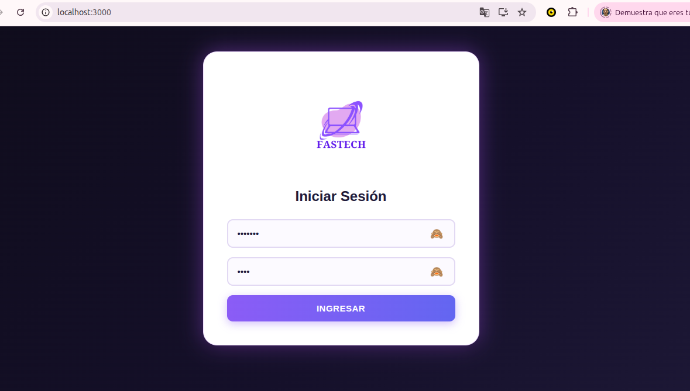
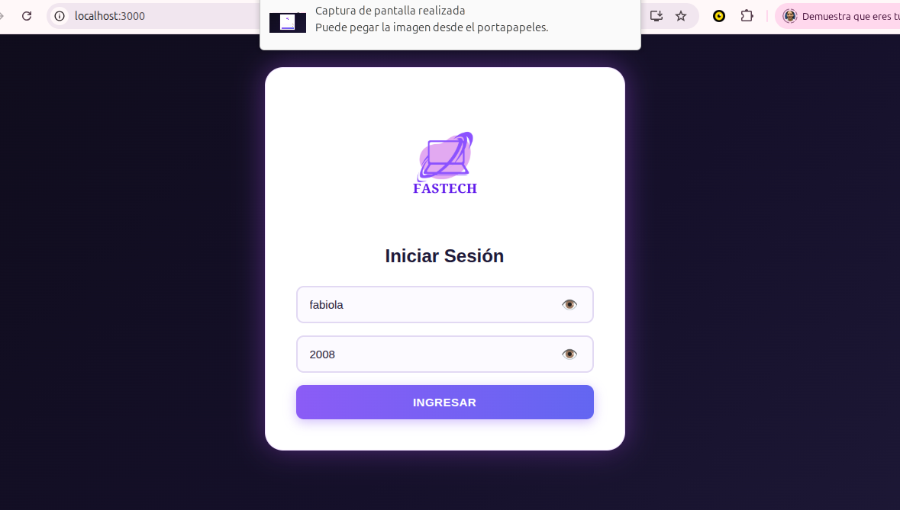
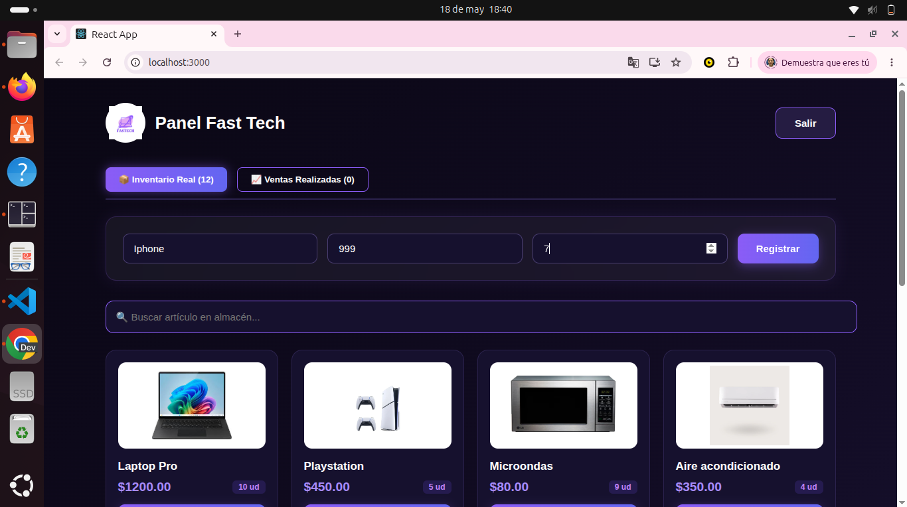
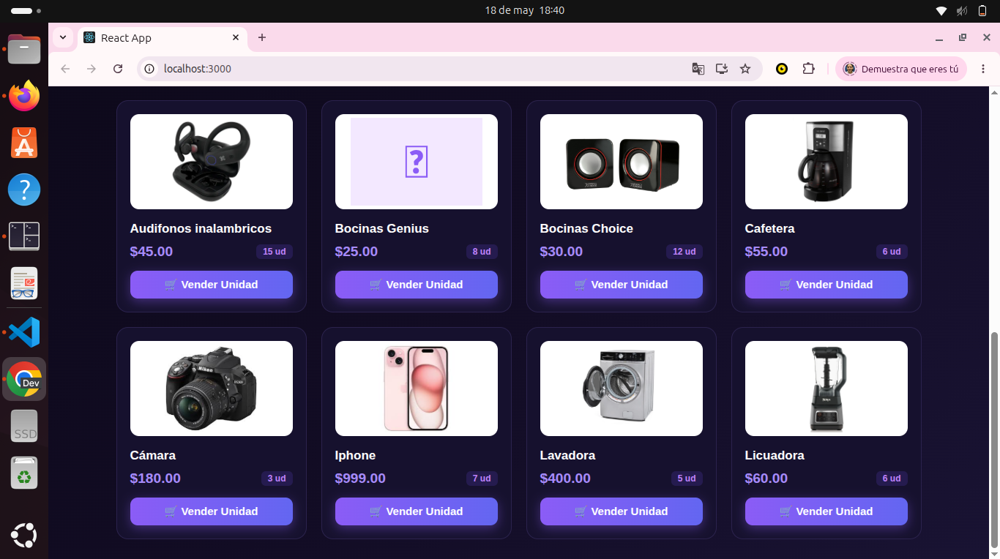
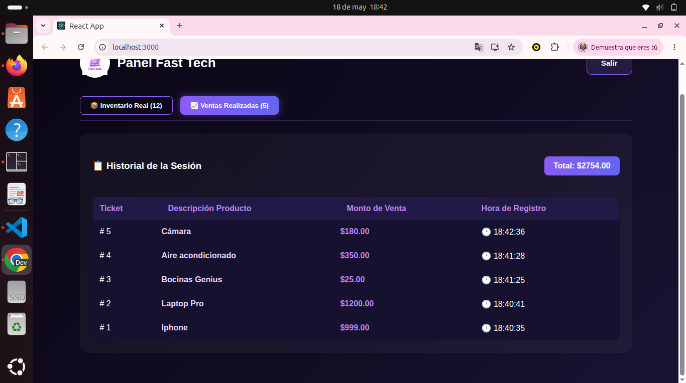
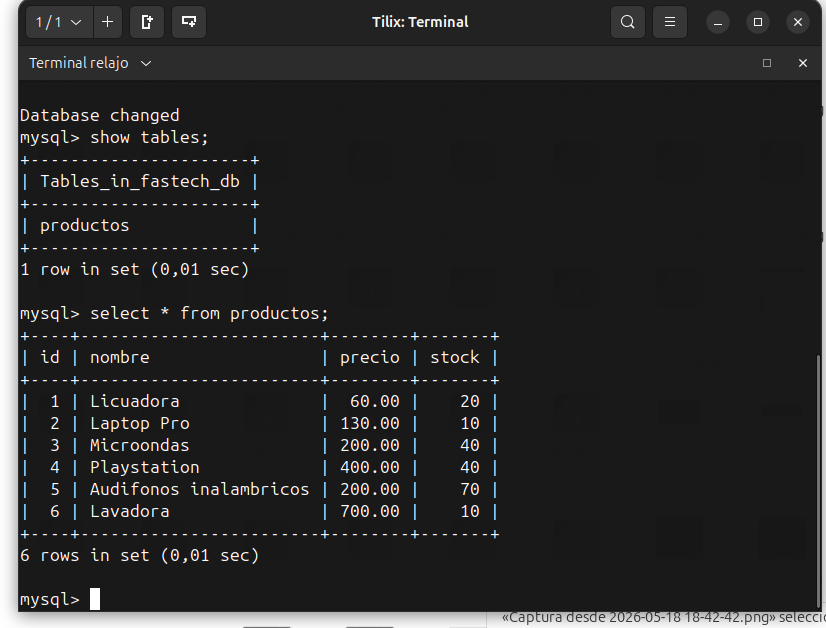

# PROYECTO01 - FASTECH

##Descripción
En este proyecto donde se ha realizado una página web, es permitir al inventario iniciar sesión para ingresar los productos qeu se van ir almacenando para la venta, donde se agregaran diversos productos para poder vender al usuario, continuamente en la pestalla de registro de ventas se visualiza la venta que se ha generado, con el monto de venta y la hora de registro para manejar las ventas que se van vendiendo a la hora, esta aplicación es una página web muy sencilla y útil para la funcionalidad del inventario.

#Características Principales del Sistema
Arquitectura Cliente-Servidor Real: La aplicación no trabaja de forma aislada; utiliza un flujo completo donde la interfaz de usuario interactúa directamente con un servidor backend (Node.js/Express) encargado de procesar las peticiones y comunicarse con el motor de base de datos relacional para resguardar la información.

Diseño UI Corporativo y Responsivo: Cuenta con una interfaz moderna basada en una paleta de colores lila, morado y gris oscuro. Además, está optimizada para ser completamente responsiva, lo que permite visualizar y gestionar las tablas de productos o los formularios desde computadoras de escritorio y dispositivos móviles (celulares) sin perder la estructura ni el orden visual.

Reactividad en Tiempo Real: Al estar construida sobre React.js, la interfaz actualiza los componentes visuales de manera inmediata al detectar cambios en el inventario, evitando tener que recargar la página web manualmente para ver los nuevos registros.

  
#CAPTURAS DE PANTALLA
###Inicio de sesión

###Introducir contraseña

###Pantalla de visualización de productos 

###Agregando productos

###Visualización de productos introducidos 

###Ventas realizadas

###Evidencia de registro en la base de dtos

 #Funcionalidades
Formulario de Registro Automatizado: Permite la entrada de nuevos artículos tecnológicos al sistema mediante campos validados para capturar el nombre del producto, la descripción técnica, el precio unitario y la cantidad disponible en stock.

Tabla Dinámica de Control de Productos: Muestra el inventario consolidado en una cuadrícula estructurada y limpia. Los usuarios pueden auditar de un vistazo rápido qué productos se encuentran listos para la distribución y el estado general del almacén tecnológico.

Módulo de Persistencia de Datos: Conecta la lógica del negocio con la base de datos (con soporte optimizado para migraciones a MariaDB/MySQL), asegurando que cada producto agregado se registre de forma permanente en tablas relacionales indexadas por llaves primarias (id AUTO_INCREMENT), previniendo la duplicidad o pérdida de información.

